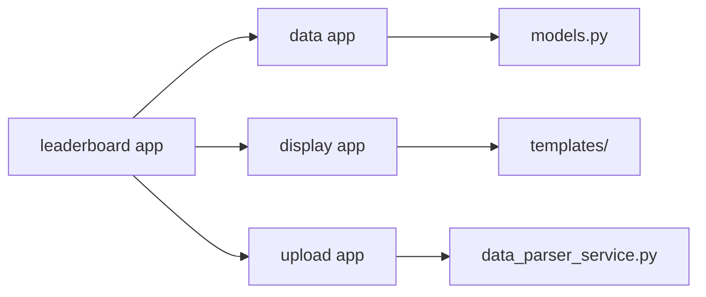
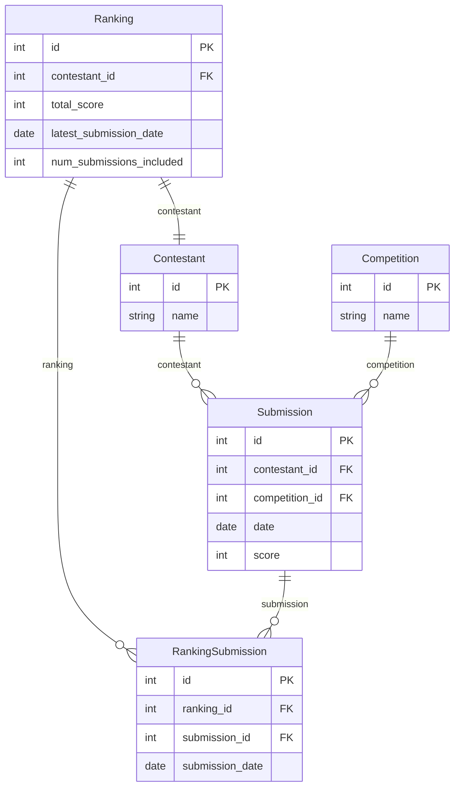

# Online Leaderboard Web Application

## Overview

This project is a web application that generates a leaderboard based on users' submission scores. The leaderboard rankings are determined by summing the best scores from each user, following specific rules.

## Leaderboard Rules

- Users are ranked by the **sum of their best submission scores**.
- **Only scores from their best 24 submissions** are counted.
- Users must have **at least 3 submissions** to appear in the rankings.

## Features

- Loads and processes scores from a provided JSON file (`scores.json`).
- Stores user scores in a PostgreSQL database.
- Calculates rankings based on defined leaderboard rules.
- Displays the leaderboard on a webpage with filtering and sorting capabilities.

## Technologies Used

- **Backend**: Python, Django, Django ORM
- **Database**: PostgreSQL
- **Frontend**: Django Templates (or alternative JavaScript framework)
- **Deployment**: Docker, Docker Compose
- **Testing**: Pytest (for verifying leaderboard logic)

## Setup Instructions

1. **Clone the Repository**

   ```bash
     git clone https://github.com/bachelarius/LeaderBoard_Python
     cd leaderboard_project
   ```

2. **Run with Docker Compose**

   ```bash
     docker-compose up --build
   ```

3. **Access the Web Application**

   Open `http://localhost:8000` to view the leaderboard.

## Usage

1. Upload a JSON file containing contestant data to update the leaderboard. An example file is located [here](data/scores (1)[13].json).
2. View the leaderboard at `http://localhost:8000`.
3. Click the "Show Submissions" button to view the submissions for each contestant.

## Project Structure

- leaderboard app
  - Contains the main application settings and URL configurations.
- data app
  - Database interactions go here
- display app
  - Handles the display of the leaderboard and related data.
- upload app
  - Handles the upload and processing of score data.



## Database entities

- Contestant: Represents a leaderboard contestant.
- Competition: Represents a competition.
- Submission: Represents a contestant's submission in a competition.
- Ranking: Represents the computed ranking of a contestant.
- RankingSubmission: Represents the submissions included in a ranking.


